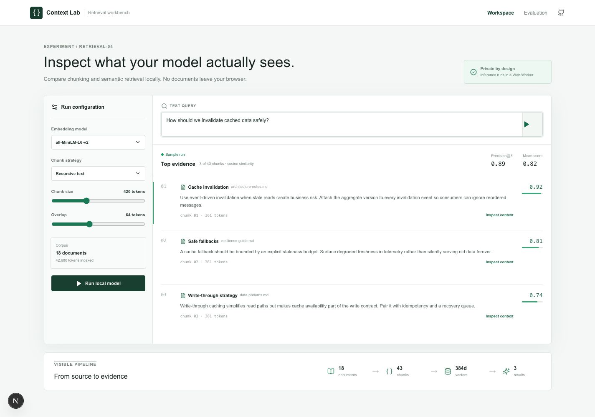
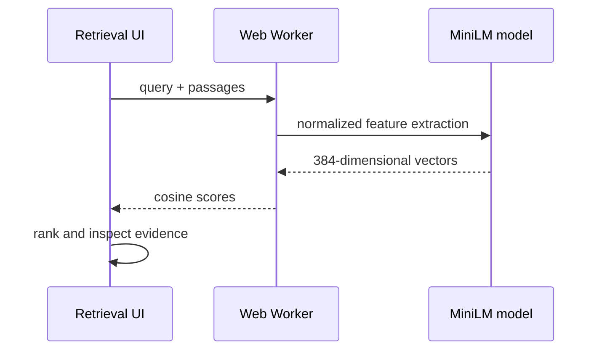

# Context Lab

> Inspect what a retrieval system actually places in front of a model.

**[Open the live retrieval workbench →](https://context-lab-blush.vercel.app)**



Context Lab is a browser-native workbench for comparing chunking choices and semantic retrieval. Documents and queries stay on the device: Transformers.js runs `all-MiniLM-L6-v2` inside a Web Worker and returns normalized embeddings for cosine ranking.

## Why this project

Retrieval quality is often hidden behind a single “AI answer.” Context Lab exposes the evidence, scores, chunk sizes, and pipeline shape so an engineer can reason about failures before tuning prompts.

- Local model inference with no API key.
- Responsive evidence inspector and retrieval metrics.
- Explicit loading and fallback states.
- Worker boundary keeps model execution off the interface thread.

## Architecture



## Run locally

```bash
pnpm install
pnpm dev
```

The first semantic run downloads the quantized model and caches it in the browser. The seeded result remains visible if model download is unavailable.

## Verify

```bash
pnpm lint
pnpm typecheck
pnpm build
```

MIT licensed.
